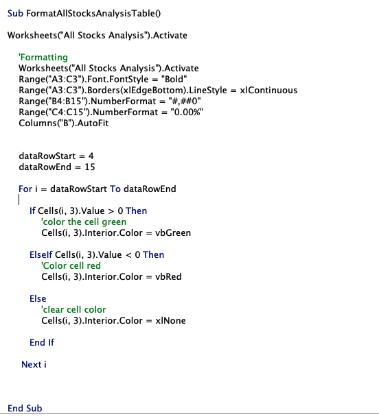

# VBA_Challenge
Data Analysis of stocks using VBA
## Project Overview
The following analysis using VBA to evaluate stock data from 2017 and 2018 and highlight the total daily volume and yearly return for each stock. 

## Results

### Stock Performace
In 2017 11 out of the  12 stocks included in this analysis saw a positive yearly return, indicating that these companies saw an increase in their stock price. In 2017, only TERP saw a negative yearly return of -7.2%. 

In 2018 however, 10 out of the 12 stocks surveyed saw a negative yearly return. Only ENPH and RUN were able to maintain a positive yearly return of 81.9% and 84.0%, respectively. 

### Code Performance
After refactoring the VBA script the time it took the code to execute decreased. The original script took 1.835938 seconds to execute for the year 2017 and 1.363281 seconds for the year 2018. 

.        

Refactoring the VBA scripted caused execution time to decrease. The refactored script took 0.2265625 seconds to execute the year 2017, and 0.2226562 seconds to execute the year 2018. 

                 

## Summary

### Assessment of Refactored Code
In general refactoring code has advantages and disadvantages. In terms of advantages, refactoring betters the structure and design of the code, making it simpiler to read, especially when multiple individuals are working on the same script. Refactoring also makes it easier to debug, as the structure is simplier and more readable. Additionally, refactoring can improve the speed at which the code executes because refactoring elimiates any unnecessary or redundent cope.  Overall, refactoring is adventagous because the quality of the code is improved while maintaining the same desired output. 

Refactoring does have disadvantages. Refactoring can be time intensive so if time is of the essence refactoring is not adventagous. Moreover, refactoring may cause new bugs in the program, which will require even more time to fix. Finally, 

### Comparing the Original and Refactored Code

The most significant advantage of the refactored VBA script compared to the orginal script is its speed in execution. In the original script the initial for loop "for i = 0 To 11 / ticker= tickers(i)/ totalVolume=0" has to execute each time the nested for loop "for j = 2 To RowCount is completed; the nested for loop has to go through every single row before moving on to the next ticker.  On the other hand, the refactored code uses the fuction "tickerIndex = tickerIndex + 1" within the for loop "for i= 2 to RowCount", causing the ticker to move to the next element in the array immediately after it has reached the final ticker in the row. In this way the original code goes over the 3013 rows 12 times while the refactored code goes over the 3013 rows once. Another advantage of the refactored code is its use of arrays "Ticker", "Total Daily Volume", and "Return". The arrays allow the final outputs to be stored and if later analysis can take place if needed. This is a disadvantage for the origial code as final outputs are not stored and further analysis cannot take place. 

One of the disadvatages of the refactored VBA code is the inclusion of the formatting within the subroutine "Sub AllStocksAnalysis()" In the original VBA code the formatting for the output worksheet has its own subroutine "Sub FormatAllStocksAnalysisTable()". I think its more organzied to have the formatting in its own subroutine because the seperate subroutines perform their sperate tasks, not multiple different tasks within one subroutine. Seperating them in this way will also help debugging if problems arise. 

                     

A disadvantage in both the original and the refactored script is the use of magic numbers. For example, the number 12 used for the elements in the array "tickers" in the origianl VBA script and the arrays "tickers" , "tickerVolumes", "tickerStaringPrice", and "tickerEndingPrice" in the refactored script could be assigned to a variable such as "tickerAmount". This can prevent errors from a magic number that is being used multiple times.

                  

Overall, the refactored code had an advantage over the original because it execute faster. On the other hand, the orginal code structure utilizes multiple subroutines to organized the different tasks being executed, while the refactored put all instructions into one subroutine. Both codes uses magic numbers, which can cause errors. Both scripts have advantages and disadvantages that can be address to optimize the script.  
